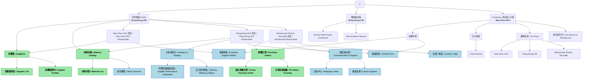

# Team4

```mermaid
    flowchart TD
    
    %% --- LEE 的工作 ---
    A --> C("共同驗證 (Auth)<br><b>Shing.Rong.LEE</b>")
    C --> C1("Register/Login (Contractor)")
    C --> C2("Register/Login (Supplier)")
    
    A --> F("數據儀表板<br><b>Shing.Rong.LEE</b>")
    F --> F1(Monitor Multi-Project Dashboard)
    F --> F2(View Analytics Reports)

    %% --- HSU 的工作 ---
    A --> B("Contractor (承包商) 功能<br><b>Wan.Zhen.HSU</b>")
    B --> D("採購管理")
    D --> D1(Manage Supplier)
    D --> D2(Create Purchase Order)
    
    B --> E("交付追蹤")
    E --> E1(Track Delivery)

%% ============= About Us Section =============
B --> B1[團隊成員 / Our Team]
B1 --> b1[Wan.Zhen.HSU]
B1 --> b2[Shing.Rong.LEE]
B1 --> b3[Muhammad Zhafran Musyaffa]
B --> B2[使命與背景 / Our Mission & Background]

%% ============= System Features Section =============
C --> W[Wan.Zhen.HSU 負責 / Wan.Zhen.HSU Responsible]
C --> S[Shing.Rong.LEE 負責 / Shing.Rong.LEE Responsible]
C --> M[Muhammad Zhafran Musyaffa 負責 / Muhammad Responsible]

%% Wan 的功能
W --> C1[供應商 / Suppliers]:::mvp
C1 --> C1a[供應商列表 / Supplier List]:::mvp
C1 --> C1b[供應商資料 / Supplier Profiles]:::mvp
W --> D1[客服專線 / Customer Support Hotline]:::nonmvp

%% Shing 的功能
S --> C2[材料目錄 / Material Catalog]:::mvp
C2 --> C2a[材料列表 / Material List]:::mvp
C2 --> C2b[庫存概覽 / Stock Overview]:::nonmvp
S --> C4[分析與評分 / Analytics & Ratings]:::nonmvp
C4 --> C4a[供應商績效儀表板 / Supplier Performance Dashboard]:::nonmvp
C4 --> C4b[交付效率報告 / Delivery Efficiency Report]:::nonmvp
S --> D2[聯絡表單 / Contact Form]:::nonmvp

%% Muhammad 的功能
M --> C3[採購訂單 / Purchase Orders]:::mvp
C3 --> C3a[建立採購訂單 / Create Purchase Order]:::mvp
C3 --> C3b[訂單狀態追蹤 / PO Status Tracking]:::mvp
M --> C5[通訊與支援 / Communication & Support]:::nonmvp
C5 --> C5a[訊息中心 / Message Center]:::nonmvp
C5 --> C5b[聯絡支援 / Contact Support]:::nonmvp
M --> D3[位置 / 地圖 / Location / Map]:::nonmvp

%% ============= Color Definitions =============
classDef mvp fill:#9BE7A9,stroke:#3BAA4A,stroke-width:1.5px,color:#000,font-weight:bold;
classDef nonmvp fill:#ADD8E6,stroke:#3B7DD8,stroke-width:1.5px,color:#000,font-weight:
```

